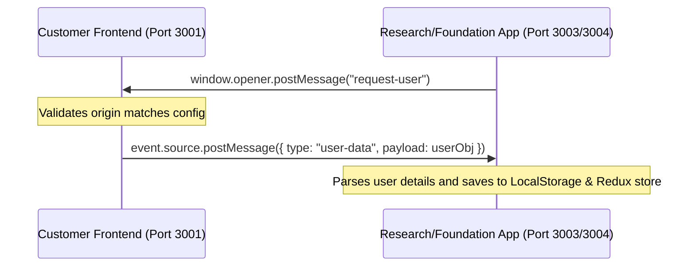

# 🚀 Infinito Comics Ecosystem

Welcome to the **Infinito Comics** repository! This is a multi-application ecosystem designed to deliver a high-quality comic reading experience, showcase CSR foundation initiatives, publish academic research on comic media, and provide a secure administration panel for platform management.

---

## 📂 Project Structure

This repository is organized as a monorepo containing one backend service and four distinct React-based web applications:

```text
├── Admin/                 # Vite + React (v18) + Tailwind (v3) Admin Panel
├── Foundation/            # Vite + React (v19) + Tailwind (v4) CSR & Foundation portal
├── Research/              # Vite + React (v19) + Tailwind (v4) Research papers portal
├── backend/               # Node.js + Express + Mongoose server
├── frontend/              # Vite + React (v19) + Tailwind (v4) Customer-facing web app
├── package.json           # Root package.json (shared dependencies list)
└── demo.js                # Character Mongoose schema template/demo reference
```

---

## 🛠️ Applications Overview

### 1. 🌐 Customer Frontend (`/frontend`)
The client-facing portal of Infinito Comics.
- **Core Stack**: React 19, Vite, Tailwind CSS 4, Redux Toolkit, Framer Motion, Slick Carousel.
- **Key Features**:
  - Comic catalog and immersive chapter viewer (PDF-based).
  - Character database containing biographies, origins, and stats.
  - Cart, pricing tiers, and subscriptions via **Infinito Ultimate**.
  - Community hubs, blogs, and support ticketing.

### 2. 🛡️ Admin Panel (`/Admin`)
A secured workspace for managers to handle database records.
- **Core Stack**: React 18, Vite, Tailwind CSS 3, Material UI (MUI), Ant Design, Formik + Yup, Zustand, React Quill.
- **Key Features**:
  - Full CRUD operations for Comics, Chapters, Characters, and Blogs.
  - Job applicant tracker and Career portal manager.
  - FAQ, Support Ticketing, and Timeline managers.
  - User list and permissions manager.

### 3. 🧪 Research Portal (`/Research`)
A dedicated web space for scientific/academic writing, research papers, and studies related to comics.
- **Core Stack**: React 19, Vite, Tailwind CSS 4, Redux Toolkit.
- **Key Features**:
  - Feed to browse research papers.
  - Deep-dive reading panel for published PDFs/papers.
  - Premium pricing model integration.

### 4. 🎗️ Foundation Portal (`/Foundation`)
Showcases CSR activities, community collaborations, and non-profit partnerships.
- **Core Stack**: React 19, Vite, Tailwind CSS 4, Redux Toolkit.
- **Key Features**:
  - Sections on the Indian Archery Association, Entrepreneurship Summits (E-Summit), Press Trust, and TEDx events.
  - Collaboration logs and partnership signups.

### 5. ⚙️ Express Backend (`/backend`)
A centralized server supplying REST APIs to all four frontend services.
- **Core Stack**: Node.js, Express 5, Mongoose (MongoDB Atlas), AWS SDK (S3), Razorpay, Nodemailer.
- **Key Features**:
  - Authentication using JWTs (JSON Web Tokens) with email OTP verification.
  - Transactional mailings (Signups, OTPs, Forgot Password) using AWS SES SMTP via Nodemailer.
  - Direct file/comic page uploads to AWS S3 bucket.
  - Payment collection and webhook verification using Razorpay.

---

## 🔄 Cross-Origin Session Sharing (SSO)

To provide a seamless experience, user login is centralized in the **Customer Frontend**. 

When a user visits the **Research** or **Foundation** apps from the main portal, session data is shared securely across different ports/domains using HTML5 **`window.postMessage`** communication:



---

## ⚙️ Environment Configuration

You must create `.env` files in each project subdirectory before starting the servers. Here are templates for each project:

### 🔹 Backend (`backend/.env`)
```ini
PORT=5000
MONGODB_URL=your_mongodb_connection_string
JWT_SECRET_KEY=your_jwt_secret_key
JWT_EXPIRY_DATE=7d
FORGET_PASSWORD_EXPIRY=15m

# CORS Allowed Origins
FRONTEND_URL=http://localhost:3001
ADMIN_URL=http://localhost:3002
RESEARCH_URL=http://localhost:3003
FOUNDATION_URL=http://localhost:3004

# AWS S3 Configurations
ACCESS_KEY=your_aws_s3_access_key
SECRET_ACCESS_KEY=your_aws_s3_secret_key
S3_BUCKET_NAME=your_s3_bucket_name
AWS_REGION=your_aws_region

# Email SES SMTP Configuration
EMAIL_ID=your_smtp_verified_email
EMAIL_PASS=your_smtp_password
SMTP_SERVER=your_smtp_server_url
SMTP_PORT=587

# Razorpay Configuration
RAZORPAY_KEY_ID=your_razorpay_key_id
RAZORPAY_SECRET_KEY=your_razorpay_secret_key
```

### 🔹 Customer Frontend (`frontend/.env`)
```ini
VITE_BASE_URL=http://localhost:5000
VITE_FRONTEND_BASE_URL=http://localhost:3001
VITE_RESEARCH_BASE_URL=http://localhost:3003
VITE_FOUNDATION_BASE_URL=http://localhost:3004
```

### 🔹 Admin Dashboard (`Admin/.env`)
```ini
VITE_BASE_URL=http://localhost:5000
```

### 🔹 Research Portal (`Research/.env`)
```ini
FRONTEND_URL=http://localhost:3001
BACKEND_URL=http://localhost:5000
```

---

## 🚀 Getting Started

### Prerequisites
- Node.js (v18 or higher is recommended)
- MongoDB Atlas account (or local MongoDB database)
- AWS Account (S3 Buckets and SES credentials)
- Razorpay developer keys

### Step-by-Step Installation

1. **Clone the Repository**
   ```bash
   git clone https://github.com/your-username/InfinitoComics-Web-develop.git
   cd InfinitoComics-Web-develop
   ```

2. **Start the Backend Server**
   ```bash
   cd backend
   npm install
   # Create .env and configure variables
   npm run dev
   ```

3. **Start the Customer Frontend**
   ```bash
   cd ../frontend
   npm install
   # Create .env and configure variables
   npm run dev
   ```

4. **Start the Admin Dashboard**
   ```bash
   cd ../Admin
   npm install
   # Create .env and configure variables
   npm run dev
   ```

5. **Start the Research Portal**
   ```bash
   cd ../Research
   npm install
   # Create .env and configure variables
   npm run dev
   ```

6. **Start the Foundation Portal**
   ```bash
   cd ../Foundation
   npm install
   npm run dev
   ```

---

## 📡 API Routing Reference

The Backend Express server listens on Port `5000` by default and registers the following routing structures:

| Route Path | Handler File / Router | Purpose |
| :--- | :--- | :--- |
| `/api` | `routes/user-routes.js` | User authentication, OTPs, password resets, details |
| `/admin` | `routes/admin-routes.js` | Admin credentials verification and dashboard auth |
| `/comic` | `routes/comic-routes.js` | Fetching and uploading new comics metadata |
| `/comicChap` | `routes/comicChap-routes.js` | Reading and management of comic chapters/PDFs |
| `/character` | `routes/character-routes.js` | Creating and displaying character profiles/stats |
| `/payment` | `routes/payment-routes.js` | Razorpay order generation and verification |
| `/blog` | `routes/blog-routes.js` | Creating, updating, and serving blog posts |
| `/research-papers` | `routes/research-paper-routes.js` | Cataloging and loading research PDFs |
| `/timeline` | `routes/timeline-routes.js` | Milestones and history points |
| `/career` | `routes/career-routes.js` | Listing job vacancies and collecting applications |
| `/support` | `routes/support-routes.js` | Storing customer feedback and support queries |
| `/faq` | `routes/faqRoutes.js` | Managing and serving FAQs |
